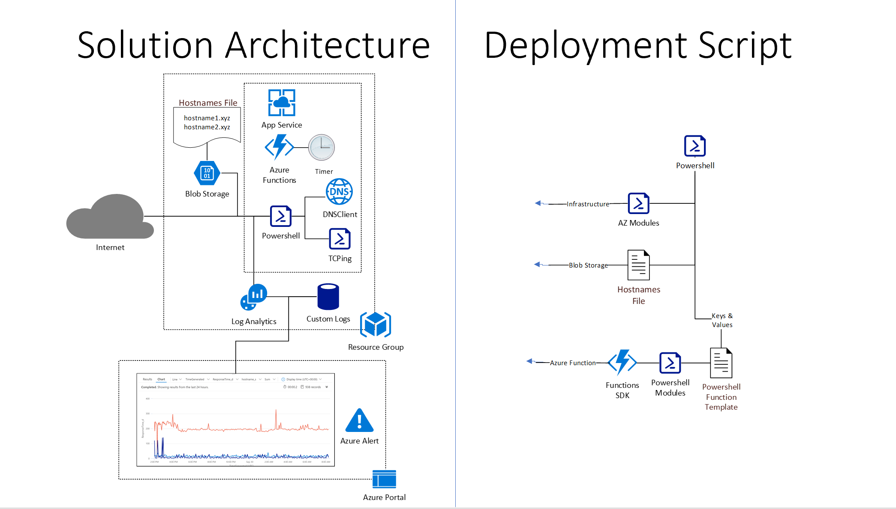
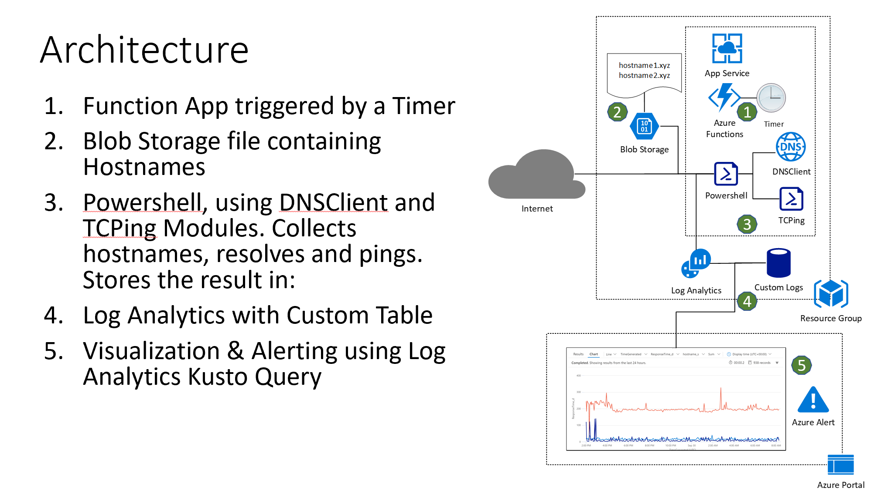
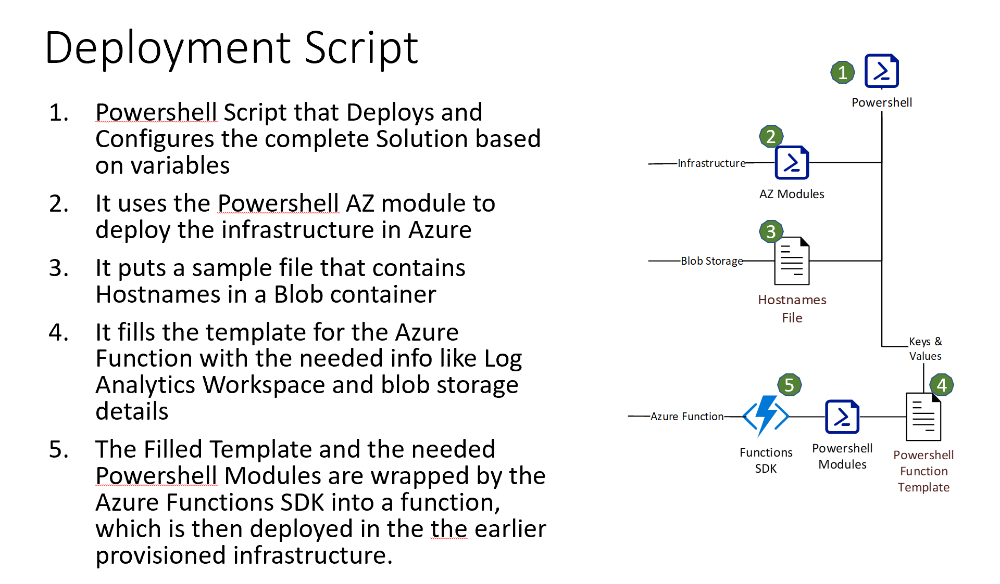

# CheckHostnames
Powershell Function that checks DNS-entries and sends ping results to Log Analytics, including full deployment script (also in Powershell)

<h3>Scenario:</h3>
Customer is moving to Azure Monitor for both Azure and On Prem Monitoring & Management.
The customer uses an On Prem scheduled Powershell script that does some checks and balances with hostnames, resolved IP-Addresses and Ping times. They want to leverage the existing script and have the results displayed together with the other visualizations in Azure Monitor and use the underlaying Alert functionality for anomalies.

<h3>Solution:</h3>
As the customer has the ambition to transition the script into more developer-style approach, we decided to get the best of both worlds: run the more traditional Powershell script and unleashing the power and flexibility of Azure Functions.
We’ve placed the list of hostnames in a simple public-readable Blob file so they can be edited independent of the deployment. The results are stored in a custom Log Analytics table and can be used for visualization or Alerts.

